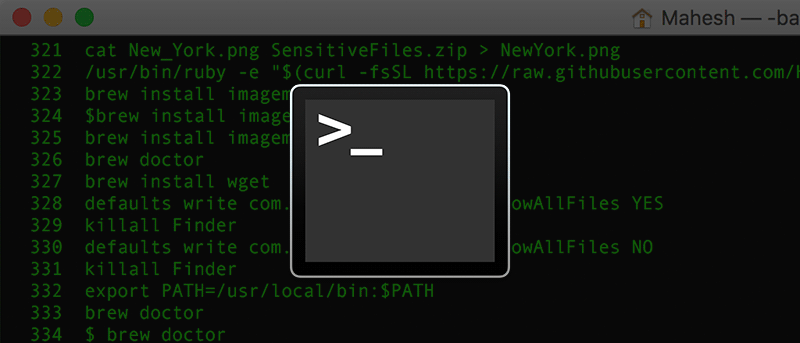
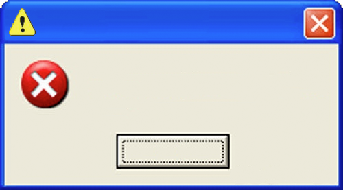

--- 
title: "title"
author: "author"
date: "`r Sys.Date()`"
site: bookdown::bookdown_site
output: 
  bookdown::pdf_book:
    includes:
      in_header: tex/template_yihui_demo.tex
    latex_engine: xelatex
    citation_package: natbib
    keep_tex: yes
documentclass: book
bibliography: [bib/bib.bib]
biblio-style: apalike
link-citations: yes
github-repo: rstudio/bookdown-demo
description: "This is a minimal example of using the bookdown package to write a book. The output format for this example is bookdown::gitbook."
---

<!--chapter:end:index.Rmd-->

# Introduction

The R package `bookdownplus` [@R-bookdownplus] is an extension of `bookdown` [@R-bookdown]. It is a collection of
multiple templates on the basis of LaTeX, which are tailored so that I can work happily under the umbrella of `bookdown`. `bookdownplus` helps you write academic journal articles, guitar books, chemical equations, mails, calendars, and diaries.

# Features

`bookdownplus` extends the features of `bookdown`, and simplifies the procedure. Users only have to choose a template, clarify the book title and author name, and then focus on writing the text. No need to struggle in YAML and LaTeX. 

With `bookdownplus` users can

-   record guitar chords,

-   write a mail in an elegant layout,

-   write a laboratory journal, or a personal diary,

-   draw a monthly or weekly or conference calendar,

-   and, of course, write academic articles in your favourite way,

-   with chemical molecular formulae and equations,

-   even in Chinese,

-   and more wonders will come soon.

Full documentation can be found in the book [R bookdownplus Textbook](https://bookdown.org/baydap/bookdownplus). The webpage looks so-so, while the [pdf file](https://bookdown.org/baydap/bookdownplus/bookdownplus.pdf) might give you a little surprise.  

# Quick start

Although this section might not be the latest version, the general idea won't change. Please see [R bookdownplus Textbook](https://bookdown.org/baydap/bookdownplus) to keep up with the update.

## Preparation

Before starting, you have to install R, RStudio, bookdown package, and
other software and packages (i.e. Pandoc, LaTeX, rmarkdown, rticle,
knitr, etc.) which bookdown depends on. See the official [manual](https://bookdown.org/yihui/bookdown/) of
bookdown for details. Additionally, if you want to produce a poster, phython must be installed before using, and the path of phython might have to be added to the environmental variables for Windows users.

## Installation

```
install.package("bookdownplus")
# or
devtools::
  install_github("pzhaonet/bookdownplus")
```

## Generate demo files

Run the following codes, and you will get some files (e.g. `index.Rmd`, `body.Rmd`, `bookdownplus.Rproj`) and folders in your working directory.

```
getwd() # this is your working directory. run setwd() to change it.
bookdownplus::bookdownplus()
```

## Build a demo book

Now open `bookdownplus.Rproj` with RStudio, and press `ctrl+shift+b` to compile it. Your will get a book file named `*.pdf` in `_book/`folder.

## Write your own

Write your own text in `index.Rmd` and `body.Rmd`, and build your own lovely book.

## More outputs

By default, the book is in a pdf file. From 'bookdownplus' 1.0.3, users can get more output formats, including 'word', 'html' and 'epub'. Run:

```
bookdownplus::
  bookdownplus(template = 'article', 
               more_output = c('html', 'word', 'epub'))
```

## Recommendations

I have been developing some other packages, which bring more features into 'bookdown', such as:

- mindr [@R-mindr], which can extract the outline of your book and turn it into a mind map, and

- pinyin [@R-pinyin], which can automatically generate ['{#ID}'](https://bookdown.org/yihui/bookdown/cross-references.html) of the chapter headers even if there are Chinese characters in them.

Both of them have been released on CRAN and can be installed via:

```
install.packages('mindr')
install.packages('pinyin')
```

Enjoy your bookdowning!

## Models

Eq. \@ref(eq:mc2) is an equation.

\begin{equation} 
E = mc^2
  (\#eq:mc2)
\end{equation} 

It can be written as $E = mc^2$.


# Results

Fig. \@ref(fig:fig1) psum dolor sit amet, consectetur adipiscing elit, sed do eiusmod tempor incididunt ut labore et dolore magna aliqua. 

```{r fig1, fig.cap='caption', out.width='80%', fig.align='center', echo=FALSE}
plot(cars)
```

Tab. \@ref(tab:tab1) psum dolor sit amet, consectetur adipiscing elit, sed do eiusmod tempor incididunt ut labore et dolore magna aliqua. 

```{r tab1, tidy=FALSE, echo=FALSE}
knitr::kable(
  head(iris, 20), caption = 'Here is a nice table!',
  booktabs = TRUE
)
```

# Conclusions

Lorem ipsum dolor sit amet, consectetur adipiscing elit, sed do eiusmod tempor incididunt ut labore et dolore magna aliqua. Ut enim ad minim veniam, quis nostrud exercitation ullamco laboris nisi ut aliquip ex ea commodo consequat. Duis aute irure dolor in reprehenderit in voluptate velit esse cillum dolore eu fugiat nulla pariatur. Excepteur sint occaecat cupidatat non proident, sunt in culpa qui officia deserunt mollit anim id est laborum

<!--chapter:end:body.Rmd-->

---
title: "Dynamic Documents using R: Hands-On"
author: "Fernando Hoces de la Guardia, BITSS"
subtitle: "RT2 Remote"
date:  "`r format(as.Date('2021-09-01'), '%d %B %Y')` | [slides](https://bitss.github.io/RT2_remote_2021/)"
output: 
  xaringan::moon_reader:
    footer: "These slides available at https://bitss.github.io/RT2_remote_2021/"
    css: [default, metropolis, metropolis-fonts] 
    lib_dir: libs
    nature:
      ratio: '16:9'
      highlightStyle: github
      highlightLines: true
      countIncrementalSlides: false
#      slideNumberFormat: |
#          <div class="progress-bar" style="width: calc(%current% / %total% * 100%);">
editor_options: 
  chunk_output_type: console
---

```{r global pars, eval=TRUE, echo=FALSE, results='hide'}
n.pers = 21
```  


# Dynamic Documents For Computational Reproducibility

.font140[
<br>
- Based on principles of *literate programming* aims at combining code and paper in one single document 

- Best framework to achieve the aspirational goal of **one-click reproducible workflow**

- Best two current implementations: `RMarkdown (R)` & `Jupyter (Python)`.  `Stata` is catching up (dyndocs release [here](https://www.stata.com/new-in-stata/markdown/) and reviews [here](http://data.princeton.edu/stata/markdown/markstat.htm) and [here](https://www.bitss.org/2017/09/05/review-of-statas-dyndoc/))

]

---
background-image: url("Images/Two universes.png")
background-size: contain

# .font80[Currently code and narrative components live in separate universes ]


---
background-image: url("Images/One universe.png")
background-size: contain

# Dynamic Documents: integrate the two universes!  


---
  
# Dynamic Documents: A Recipe  

.font140[
<br>
- 1 simple language that can combine text and code: `Markdown` 

- 1 statistical package to do the analysis (`R`, `Python`, `3S's?`)

- 1 machinery to combine analysis and text to create a single output: `Pandoc`

- [Optional-but-not-really] 1 program to bring all the elements together: RStudio/RMarkdown, Jupyter
]
---
background-image: url("Images/RStudioCS.png")
background-size: contain
# Markdown laguange/syntax in 60 seconds


---
background-image: url("Images/RMarkdownFlow.png")
background-size: contain
background-position: 0% 80%
# One Type of Dynamic Document: R Markdown

.font140[
<br>
- `R`: **open source** programming language design for statistical analysis.   

- RStudio: free software that provides and Integrated Development Environment (IDE)  

- RStudio combines all together: R + Markdown + Pandoc to produce multiple outputs
]

---
background-image: url("Images/RMarkdownOutputFormats.png")
background-size: contain
# R Markdown  


---

# Basic Structure

- A header
- Text
- Code: inline and chunks

---

# Basic Structure: Header

```{r smpl yml, eval=FALSE, echo=TRUE}
---
title: "Sample Paper"
author: "Fernando Hoces de la Guardia"
output: html_document
---
```  


---

# Basic Structure: Body of Text

```{r smpl_yml1, eval=FALSE, echo=TRUE}
---
header
---
```

This is where you write your paper. Nothing much to add. You can check Markdown [syntax here](https://www.rstudio.com/wp-content/uploads/2015/02/rmarkdown-cheatsheet.pdf). And it can use can type equations using LaTex syntax!

---

# Basic Structure: Code Chunks and Inline

```{r smpl_yml2, eval=FALSE, echo=TRUE}
---
header
---
```

Body of text. 


To begin a piece of code ("code chunk"). Enclose them in the following expression (Ctrl/Cmd + shift/optn + i) 

````
```{r, eval=TRUE}`r ''`
here goes the code
```
````


To write inline use only one Back-tick to open followed by an "r" and one to close.

---


# Practical Excercise  Goals  


**Primary Goals:**  
1 - Become familiar with your first DD.    
2 - Compile an empty (or default) DD into multiple formats.   
3 - Edit a DD with some narrative, some code (in R) and some math (optional).   
4 - Present all the results dynamically into multiple outputs.   

\pause 

**Secondary Goal:**    
1 - Expose you to some R programming.   
2 - Entertain you with a fun problem.  

---

# Hands-on excercise: the birthday problem!

As an illustration lets write a report using the participants in this workshop to illustrate the famous [birthday problem](https://en.wikipedia.org/wiki/Birthday_problem). 

>What is the probability that at least two people this room share the same birthday?

>There are `r n.pers` in this room. 

>Is it something like $\frac{1}{365} \times  `r n.pers`=$   `r round(1/365 * n.pers, 3)`?

---
# Create a new RMarkdown File

1 - In RStudio: `File-> New File -> RMarkdown...`  
2 - Name it, and save it as `/3-dynamicdocs/first_dd.Rmd`.   
3 - Review/edit the header, and delete all the default body of text except for one code chunk.   
4 - In that chunk define a seed (`set.seed(1234)` and number of people in the room (`n.pers = ?`).  
5 - Below the first chunk, write down a title (using `#`) and a brief description.

---

# The birthday problem: the math
Actually the math says otherwise: 
\begin{align} 
 1 -  p(n) &= 1 \times \left(1-\frac{1}{365}\right) \times \left(1-\frac{2}{365}\right) \times \cdots \times \left(1-\frac{n-1}{365}\right) \nonumber  \newline
 &= \frac{ 365 \times 364 \times \cdots \times (365-n+1) }{ 365^n } \nonumber \newline
 &= \frac{ 365! }{ 365^n (365-n)!} = \frac{n!\cdot\binom{365}{n}}{365^n}\newline
p(n= `r n.pers`) &= `r  round(1 - factorial(n.pers) * choose(365,n.pers)/ 365^n.pers, 3)`  \nonumber
\end{align}

---

# Code for the math (`/3-dynamicdocs/first_dd_solution.Rmd`)

Not relevant to look at: just copy and paste lines 23-30 from the solutions into your dynamic document (`first_dd_solution.Rmd`). 

```{r math, eval=FALSE}
\begin{align} 
 1 - \bar p(n) &= 1 \times \left(1-\frac{1}{365}
                                 \right) 
 \times ...
 A lot of equations using LateX syntax!
\end{align}
```

---

# Don't like math? Let's run a simple simulation!   
 1 - Simulate 10,000 rooms with $n = `r n.pers`$ random birthdays, and store the results in matrix where each row represents a room.   
 2 - For each room (row) compute the number of unique birthdays.   
 3 - Compute the average number of times a room has `r n.pers` unique birthdays, across 10,000 simulations, and report the complement.    


---

# Code for the simulation (`/first_dd_solution.Rmd`)  

```{r birthday prob, eval=TRUE, echo=TRUE}
birthday.prob = function(n.pers, n.sims) {
  # simulate birthdays
  birthdays = matrix(round(runif(n.pers * n.sims, 
                                 1, 365)), 
                      nrow = n.sims, ncol = n.pers)
  # for each room (row) get unique birthdays
  unique.birthdays = apply(birthdays, 1, 
                           function(x) 
                             length(unique(x)) )
  # Indicator with 1 if all are unique birthdays
  all.different = 1 * (unique.birthdays==n.pers)
  # Compute average time all have different birthdays 
  result = 1 - mean(all.different)
return(result)
}
n.pers.param = n.pers; n.sims.param = 1e4
birthday.prob(n.pers.param,n.sims.param)
```

---

# Results   
- Many people originally think of a prob ~ $\frac{1}{365} \times N =$   `r round(1/365 * n.pers.param, 3)`
- However the true probability is of $p(n= `r n.pers.param`) = `r round(1 - factorial(n.pers.param) * choose(365,n.pers.param)/ 365^n.pers.param, 3)`$
- And the simulated probability is of  `r birthday.prob(n.pers = n.pers.param, n.sims = n.sims.param)`


---

# Let's try some other outpus  
 
 - Word?
 - pdf?
 - book?
 - slides?
 - dashboard?
 - shiny app?
 

---


# Practical Excercise #2: Mostly Harmless Econometrics!

There is a [fantastic Github](https://github.com/vikjam/mostly-harmless-replication) repo that is reproducing results from MHE 

Lets use the of examples Figure [5.2.4](https://github.com/vikjam/mostly-harmless-replication/blob/master/05%20Fixed%20Effects%2C%20DD%20and%20Panel%20Data/Figure%205-2-4.r) to show how dynamic docs can be used in data analysis. 

---

## Figure to reproduce  


  
---

# Goals for excercise #2  

**Primary Goals:**  
1 - Demonstrate how the **entire workflow** of a study can fit into a DD.   
2 - Show how to add options to the header.  
3 - Demonstrate how a DD make code readable to non-coders.   

\pause 

**Secondary Goal:**    
1 - Expose you to some R programming.   

---

# Instructions to get started with excercise #2:

1 - Create a new blank `.Rmd` file (steps 1 - 3 in from previous ex.)
2 - Save it as `/3-dynamicdocs/Figure 5-2-4.Rmd`   
3 - Look at [this code](https://github.com/vikjam/mostly-harmless-replication/blob/master/05%20Fixed%20Effects%2C%20DD%20and%20Panel%20Data/Figure%205-2-4.r) behind figure 5.2.4.  
4 - Start building your own DD to describe what this code does. 

We will go step by step using `/3-dynamicdocs/Figure 5-2-4_solutions.Rmd` as back-up.

---

# Description

- Begin a new section (`##`), titled "Description"  

- Write a brief description of our goal in the DD.   

- You might want to insert a reference to the paper: [link here](http://economics.mit.edu/files/589).  

- Specific content not so relevant, just refer to "a treatment" and "a outcome".  

---

# Getting the raw data

- Begin a new section (`##`), titled "Raw Data".   
- Describe what you will do.  
- Create two code chunks:
````
```{r download data, eval=FALSE, echo=TRUE, 
warning=FALSE, results='hide', message=FALSE}`r ''`
here goes the code
```
````


---

# Cleaning the data

- Begin a new section (`##`), titled "Data Cleaning".   
- Describe what you will do:  
    - Restrict sample to years between 1979 and 1995 (inclusive)  
    - Guam from the sample (state = 98).   
- Create one code chunk:  
````
```{r data cleaning, echo=TRUE}`r ''`
here goes the code
```
````

- Add some description on the data (using dynamic reporting). See solutions (Figure `5-2-4_solutions.Rmd` line 58) for examples.   

---

# Build the analytic file

- Begin a new section (`##`), titled "Build analytic file".   
- Describe what you will do.   
- We need to construct the following variables:   
    - Log of total employment  
    - Normalize the year variable to 1978  
- Insert a new code chunk:

````
```{r analytic file, echo=TRUE}`r ''`
here goes the code
```
````

---

# Describe the model to estimate (optional)  

- Begin a new section (`##`), titled "Define model to estimate".   
- One line describing what we want to estimate (i.e. "We want to estimate a fixed effect model with lead and lag treatment variables").     
- A mathematical model that represents the equation to be estimated (look at solutions). 

---

# Vizualize the results (optional)  
- Begin a new section (`##`), titled "Vizualize the results".   
- One line describing what we want to estimate (i.e. "This estimates are then used to create figure 3 of the original paper, which is figure 5.2.4 in MHE.").  
````
```{r viz}`r ''`
here goes the code
```
````

---

# Practical Excercise #2  
- Run your version into multiple outputs.   
- Run the solutions version into multiple outputs.   
- Compare document with original version of the code.   

---

# Bonus truck: NBER Working Papers!
- Remeber the example from yesterday on the half bake analysis of NBER papers in github?

- Fork and clone the repo one more time: 
[github.com/fhoces/nber_trends](https://github.com/fhoces/nber_trends)

- Now knit the `.Rmd` file instead. 


---

# Final Remarks & More Resources
 - With DD we can achieve a one-click reproducible workflow.
 - This is particularly helpful to understand/present results that are hard to digest.
 - More great examples in the workshop repo (`x-moredynamicdocs`).
 - Want to learn more: [great free books](https://bookdown.org/) (can you guess how they were written?)

<!--chapter:end:dd-rmarkdown.Rmd-->

---
title: "Untitled"
author: "Fernando Hoces de la Guardia"
date: "9/1/2021"
output:
  beamer_presentation: default
  ioslides_presentation: default
  slidy_presentation: default
---

```{r setup, include=FALSE}
knitr::opts_chunk$set(echo = FALSE)
```

## R Markdown

This is an R Markdown presentation. Markdown is a simple formatting syntax for authoring HTML, PDF, and MS Word documents. For more details on using R Markdown see <http://rmarkdown.rstudio.com>.

When you click the **Knit** button a document will be generated that includes both content as well as the output of any embedded R code chunks within the document.

## Slide with Bullets

- Bullet 1
- Bullet 2

## Slide with R Output

```{r cars, echo = TRUE}
summary(cars)
```

## Slide with Plot

```{r pressure}
plot(pressure)
```


<!--chapter:end:first_dd_slides.Rmd-->

---
title: "Explaining the Bithday Problem"
author: "Fernando Hoces de la Guardia"
date: "12/5/2017"
output:
  word_document: default
  html_document: default
  pdf_document: default
---

```{r setup, include=FALSE}
knitr::opts_chunk$set(echo = TRUE)
set.seed(1234)
n.pers = 4
```

# Birthday problem  
What is the probability that at least two people share the same birhtday in this room?

Is is $\frac{1}{365} \times `r n.pers` = `r 1/365 * n.pers`$


## Analytical solution  

But actually when we compute the math. We get  an  surprising result: 

\begin{align}   
 1 - \bar p(n) &= 1 \times \left(1-\frac{1}{365}\right) \times \left(1-\frac{2}{365}\right) \times \cdots \times \left(1-\frac{n-1}{365}\right) \nonumber  \\  &= \frac{ 365 \times 364 \times \cdots \times (365-n+1) }{ 365^n } \nonumber \\ &= \frac{ 365! }{ 365^n (365-n)!} = \frac{n!\cdot\binom{365}{n}}{365^n}\\
p(n= `r n.pers`) &= `r  round(1 - factorial(n.pers) * choose(365,n.pers)/ 365^n.pers, 3)`  \nonumber
\end{align}


## Simulations  

1 - Simulate 10,000 rooms with n = `r n.pers` random birthdays, and store the results in matrix where each row represents a room.  
2 - For each room (row) compute the number of unique birthdays.  
3 - Compute the average number of times a room has `r n.pers` unique birthdays, across 10,000 simulations, and report the complement.  

  
```{r}
birthday.prob = function(n.pers, n.sims) {
  # simulate birthdays
  birthdays = matrix(round(runif(n.pers * n.sims, 1, 
                                 365)), nrow = n.sims, 
                           ncol = n.pers)
  # for each room (row) get unique birthdays
  unique.birthdays = apply(birthdays, 1, unique)
  # Indicator with 1 if all are unique birthdays 
  all.different = (lapply(unique.birthdays, length) == n.pers) # Compute average time all have different birthdays 
  result = 1 - mean(all.different)
return(result)
}
n.pers.param = n.pers
n.sims.param = 1e4 
birthday.prob(n.pers.param,n.sims.param)
```

Ok, I am convinced that the probability of atl least two people in this room share the same birthday is `r birthday.prob(n.pers.param,n.sims.param)`


<!--chapter:end:first_dd_solution.Rmd-->

---
title: "Git for Non-Programmers"
author: "Fernando Hoces de la Guardia, BITSS"
subtitle: "RT2 Remote"
date:  "`r format(as.Date('2021-09-01'), '%d %B %Y')` | [slides](https://bitss.github.io/RT2_remote_2021/)"
output: 
  xaringan::moon_reader:
    footer: "These slides available at https://bitss.github.io/RT2_remote_2021/"
    css: [default, metropolis, metropolis-fonts] 
    lib_dir: libs
    nature:
      ratio: '16:9'
      highlightStyle: github
      highlightLines: true
      countIncrementalSlides: false
#      slideNumberFormat: |
#          <div class="progress-bar" style="width: calc(%current% / %total% * 100%);">
editor_options: 
  chunk_output_type: console
---
count:false
# Before we begin 

.font150[

<br><br>
- [GitHub desktop app](https://desktop.github.com/) installed?

- Create an account at [GitHub.com](http://www.github.com/)?

- If no to any, please do it now (recommend to exit zoom temporarily to allow for internet bandwidth)

]

---

background-image: url("Images/iceberg.jpg")
background-size: 50%
background-position: 100% 50%
# Motivation: Computational Reproducibility

<!--- https://imgflip.com/i/5lb28s -->

.pull-left[
<br>
.font120[
    Clarebout Principle:
    </br></br>
    “An article about computational science in a scientific publication is not the scholarship itself, it’s merely scholarship advertisement. The actual scholarship is the complete software development environment and the complete set of instructions which generated the figures.”
.right[  <cite> Buckheit and D.L. Donoho (1995, [2009](https://academiccommons.columbia.edu/doi/10.7916/D8QZ2MDS/download))</cite>]
]

]


---
# Git/Github for Version Control 
.font150[
<br>
- Version Control Software is an increasingly popular tool for computational reproducibility

- Git is a type of VCS and Github company that build on top of .   

- They are very popular among programmers, but not so much among non-programmers. 

- Why? I believe it has to do with GUIs.

]
---

# What is a GUI and why the bad reputation

.font150[
<br><br>
**G**raphical **U**ser **I**nterface   

- For most of us (non-programmers): *GUI = Software*.  

- GUIs are behind the popularization of personal computers. 

- Unfortunately GUIs are pretty bad at keeping a record of actions taken (bad for reproducibility).
]

---

# What is not a GUI?

.font140[  

- Any software that is run in the command line (aka terminal, shell, bash, etc).  

]



.font140[ 

- Git was designed to run in the command line.

- Today we will learn Git **without** the command line.
]

---

# What is Git 1/2
.font150[
<br>
- Git is a software designed to track the **entire** history of the code of a project. 

- Designed originally for software development, it has gained important traction in the research community. 

- Main appeal: facilitates full reproducibility and collaboration. 

- Git is mainly meant to work as a non-GUI (in the command line) software.   
**However:** most of the key features can be used through a GUI. 
]
---

# What is Git 2/2

.font150[ 
<br>
- By code Git understands any type of plain text file (`myfile.R`, `myfile.do`, `.tex/.md/.txt/.csv/.etc`).

- This type of file can be understood as "human readable" as machine and human see the same fie. 

- Files that are "non-human readable" are called binary files (`myfile.docx`, `myfile.xlxs`, `.pdf/.exe/.dta/.etc`).

- Git can also detect changes in binary files, but it cannot show those changes.
]

---

# What is Github
.font150[
<br>
- Github is a company that provides two services (that we care of): 
  - A web hosting service for all our files track with Git (public free/private $ or free if academic).  
  - A GUI software (Desktop App) that provides user friendly access to Git.

- Others hosting ss include: Bitbucket, GitLab, Gitkraken, etc. 

- Other GUIs include: SourceTree, Gitkraken, Atom, RStudio.

]

---

# The Primary Goal of Version Control (for us)

.font150[
<br><br>
**The Goal:** keep track of any potentially meaningful modification to your code.  
]
--
.font150[
**Secondary Goal:** learn how to collaborate with others using Github.   
]
--
.font150[
**Bonus track:** get you excited about using open source statistical software (R, Python, Julia, etc)
]

---
# Strategy 1:  

.font150[
<br>
1. Agree on a naming convention with your co-authors (eg: YYYYMMDDfilename_INITALS).  

2. Begin working from the last saved version (eg: `20180325demo_FH.do`).  
3. At the end of the day, save on a new version (eg: `20180327demo_FH.do`).  

**Pros:** Easy adoption.   

**Cons:** Error prone, hard to document, lots of files for each document.     
]
---

# Strategy 2:  

.font150[
<br>

1. Name your file `filename` (ideally `01_filename`)  
2. Take a snapshot of your work every time you complete relevant change (day, hour or minutes).  
3. Update your entire working folder to the cloud.   


**Pros:** Error proof, seamless documentation, one file per document, track differences across all versions, meant to work with the cloud. 

**Cons:** Harder adoption.   
]
---
background-image: url("Images/phdcomics.png")
background-size: contain


# We want to avoid this situation:   


---
background-image: url("Images/version_control_diagram.svg")
background-size: contain 

# Comparison of Workflows


---

# Other reasons to use Git

.font150[
<br><br>
- To access a whole new world of knowledge!    

- Great tool for collaboration.  
- Easier to test all sorts of ideas/models. 
]
---
background-image: url("Images/git.png")
background-size: contain
exclude:true
# Managing expectations
<!--
talk about undo here
-->
---
# Demos

## Five Demos: 
<br>
.font140[

1 - **Simple but instructive.**   

2 - Repeat with branches.  
 
3 - Repeat with collaboration: pull requests.   

4 - Repeat with collaboration: shared ownership.   

5 - Explore a real life repo.    
]
---

# Demo #1: We Start in the Cloud 
<br>
.font130[

1 -  Create [github.com](github.com) account and sign in.   

2 -  Let's look at some **repos:**  
  - Papers: [Labor](https://github.com/tyleransom/AES-Roy-Majors), [Health](https://github.com/mkiang/opioid_treatment_distance), [Public Finance](https://github.com/OpportunityInsights/welfare_analysis)    
  - Courses: [So](https://github.com/edrubin/EC607S21), [many](https://github.com/floswald/ScPo-Labor/), [methods](https://github.com/woerman/ResEcon703), [courses](https://github.com/paulgp/applied-methods-phd) 
  - Covid: [JHU](https://github.com/CSSEGISandData/COVID-19), [Imperial](https://github.com/ImperialCollegeLondon/covid19model), [NYT](https://github.com/nytimes/covid-19-data), [The Economist](https://github.com/TheEconomist/covid-19-excess-deaths-tracker), [EconTracker](https://github.com/OpportunityInsights/EconomicTracker)
  - and more: [nice diagrams](https://github.com/grantmcdermott/tikzexamples), [meta-guides](https://github.com/Alalalalaki/Guide2EconRA), [books](https://github.com/BITSS/ACRE), [guaguas!](https://github.com/rivaquiroga/guaguas)

3 -  First way to access content: download.   

4 -  What if you want to have your own copy of the repo? **Fork** it!  

]
---
# Demo #1: We move to our local computer 
<br>
.font130[
5 -  Now create your own repo. Initiate readme and make some edits.   

6 - **Clone** the repo. Explore the files and location.   

7 - Create new files, edit. And **commit**. Edit again, and commit again.   

8 - **Push.** Edit on github.com, and **pull.**   

9 - For this tutorial, best way to access previous version: explore in github.com and download.

]

<br><br><br><br>
.right[
[here is some help with the lingo](handout.pdf)
]

---
# Five Demos 2/5: 
<br>
.font140[

1 - Simple but instructive.   
    *Review: def repo, github.com, download, clone, destination folder, fork, create repo, commit, push, pull, delete, search repo, download old version.*   

2 - **Repeat with branches.**  
 
3 - Repeat with collaboration: pull requests.   

4 - Repeat with collaboration: shared ownership.   

5 - Explore a real life repo.     
    ]
---
# .font80[Demo #2: Branches and collaboration (we wil be here a while)]
<br>
.font140[

1 - Create a branch from previous repo.  

2 - Add new content (do not replace), commit a few times, and go back and forth to the main branch.  

3 - Go back to main branch (master), observe file, merge.  

4 - Look at the history of the main branch.   

5 - Repeat 1-3 but now replace instead of adding content.    
 
]
---
# Fatal Error!
<br><br><br><br>
```{r out.width = '50%', echo=FALSE, fig.align='center'}
# url
 
```


---
background-image: url("Images/calm_burn.jpg")
background-size: contain

# Burn it and start with a fresh copy!

<br><br><br><br><br><br><br><br><br><br><br><br><br><br><br><br>

.right[
  [Jenny Bryan's Advice](https://speakerdeck.com/jennybc/happy-git-and-github-for-the-user)
]
---
# Five Demos: 3/5 

<br>
.font140[


1 - Simple but instructive.   
    Review: def repo, github.com, download, clone, destination folder, fork, create repo, commit, push, pull, delete, search repo, download old version.  
    
2 - Repeat with branches.  
    *Review: All of the above, plus: branch, merge, resolve conflicts.*  
    
3 - **Repeat with collaboration: pull requests.**  

4 - Repeat with collaboration: shared ownership.     

5 - Explore a real life repo.  


]
---
# Two formats of collaboration  
<br>
.font140[

- One owner, many pull requests.  
    - Easier to control, requires constant updating of forks.   
    
- Many owners, all can push.   
    - **Very** important to pull at the beginning and at before each push. 
]
---
# Demo #3: Pull requests
<br>
.font140[

1 - Fork repo [github.com/BITSS/test_birthday](https://github.com/BITSS/test_birthday), and clone it into your machine.  

2 - Edit fields of name, and birth date.   

3 - Save, commit and push.   

4 - Create your first **pull request**.   

5 - Let's see if I can manage all those pull requests very quickly (maybe illustrate issues).   

6 - Now find your neighbors repo of Demos 1 & 2, fork it, clone it, make a change, save, commit, and...
] 

---
# Five Demos: 4/5 
.font140[
1 - Simple but instructive.   
    Review: def repo, github.com, download, clone, destination folder, fork, create repo, commit, push, pull, delete, search repo, download old version.  
    
2 - Repeat with branches.  
    Review: All of the above, plus: branch, merge, resolve conflicts.   
    
3 - Repeat with collaboration: pull requests.   
    *Review: collaborate via fork + PR*  
    
4 - **Repeat with collaboration: shared ownership. **    

5 - Explore a real life repo.  

]
---
# Demo #4: Many owners

.font140[
    
1 - Half of you (\#1): go back to the repo of demo 1 & 2 and invite a collaborator.  
(Suggestion: the "forker" finds the repo, the "forkee" is invited  
, edits, commits,  and push/pull)  
]
--
.font140[
2 - The other half (\#2): clones, commits and pushes.  
]
--
.font140[
3 - \#1 commits and pushes in **different lines**.    
]
--
.font140[
4 - Switch and repeat 2 & 3: \#2 commits first and pushes, then \#1.    
]
--
.font140[
5 - Repeat 2 - 4 but now both of you in the same lines.    
]

--
.font140[
6 - Repeat now but with branches (optional).    
]


---
# Five Demos: 5/5 
.font140[

1 - Simple but instructive.   
    Review: def repo, github.com, download, clone, destination folder, fork, create repo, commit, push, pull, delete, search repo, download old version.  

2 - Repeat with branches.  
    Review: All of the above, plus: branch, merge, resolve conflicts.   

3 - Repeat with collaboration: pull requests.   
    Review: collaborate via fork + PR  

4 - Repeat with collaboration: shared ownership.     
    *Review: collaborate via share ownership.*  

5 - **Explore a real life repo. ** 
]   


---
# Demo #5: .font80[Look inside a real-life project (and collaborate!)]
.font140[
1-  Find the following repo: [`github.com/BITSS/opa-wealthtax`](https://www.github.com/BITSS/opa-wealthtax).   

2-  Fork it and clone it.    

3-  Open it in your computer: `opa-wealthtax.Rproj` (needs RStudio), look around and execute 
`code/dynamic_doc/wealth_tax_dd.Rmd`.  

4-  Find elasticities at `rawdata/edits/research.csv`, modify one elasticity, document, execute again.

5 - Find `code/interactive_visualization/server.R` and in line `1561` change `red` to `blue`
]


---
# Five Demos: 5/5 
.font140[
1 - Simple but instructive.   
    Review: def repo, github.com, download, clone, destination folder, fork, create repo, commit, push, pull, delete, search repo, download old version.  
    
2 - Repeat with branches.  
    Review: All of the above, plus: branch, merge, resolve conflicts.   
    
3 - Repeat with collaboration: pull requests.   
    Review: collaborate via fork + PR  
    
4 - Repeat with collaboration: shared ownership.     
    Review: collaborate via share ownership.  
    
5 - Explore a real life repo.  
    *Review: All of the above, plus: how does a real-life example looks like.* 
]

---
# Now go and explore!
<br>
.font140[

Some good habits:   
- Commit often (<1hr)  

- Always pull before you start a new session of work. Also good to pull before pushing.    

- Think of your remote as the most important set of files. Get used to deleting things in your local machine.    
]

---
# Want to Learn More: Version Control

## Tutorials

.font140[

- [Great 20 min intro to Git by Alice Bartlett](https://www.youtube.com/watch?v=eWxxfttcMts)  
- [Great 2hr tutorial to Github by Jenny Bryan (git ninja)](https://www.rstudio.com/resources/videos/happy-git-and-gihub-for-the-user-tutorial/)  
- Software Carpentry's [step-by-step tutorial (command line)](https://swcarpentry.github.io/git-novice/). 
]

## Documentation

.font140[

- Jenny Bryan's [Happy Git](http://happygitwithr.com/)
- [Documentation from Matthew Gentzkow and Jesse Shapiro](http://web.stanford.edu/~gentzkow/research/CodeAndData.pdf)
- Karthik Ram's paper on [Git for Research](https://scfbm.biomedcentral.com/articles/10.1186/1751-0473-8-7) 
]

---
# .font80[Economists Doing Highly Reproducible Work<sup>1</sup>] 

.pull-left[

**People**
- [Nick Huntingon](https://github.com/NickCH-K) 
- [Shoshana Vasserman](https://github.com/shoshievass)  
- [Lars Vilhuber](https://github.com/larsvilhuber)
- [Grant McDermott](https://github.com/grantmcdermott)
- [Tyler Ransom](https://github.com/tyleransom)
- [Ed Rubin](https://github.com/edrubin)
- [Luiza Andrade](https://github.com/luizaandrade)
- [Max Kasy](https://github.com/maxkasy)
- [Matt Jensen](https://github.com/MattHJensen)
- [Jason DeBacker](https://github.com/jdebacker)
- [John Horton](https://github.com/johnjosephhorton)
- [Cora Kingdon](https://github.com/ckingdon95)
- [Chandler Lester](https://github.com/chandlerlester)

]
.pull-right[
- [Alvaro Carril](https://github.com/acarril)
- [Andrew Heiss](https://github.com/andrewheiss)
- [Lisa Rennels](https://github.com/lrennels)
- [Michael Stepner](https://github.com/michaelstepner)
- [Lachlan Deer](https://github.com/lachlandeer) 
- [Rebekah Din](https://github.com/rebekahanne)


**Organizations**
- [LOST](https://lost-stats.github.io/)
- [Opportunity Lab](https://github.com/Opportunitylab)
- [Congressional Budget Office](https://github.com/US-CBO)
- [Policy Simulation Library](https://github.com/PSLmodels)
- [Gentzkow & Shapiro Lab](https://github.com/gslab-econ)
- [Urban Institute](https://github.com/UrbanInstitute)
]

</br></br>
.footnote[
[1]: Non-exhaustive list of people and organizations doing amazing reproducible work on github (other than us!)
]


```{r gen_pdf, include = FALSE, cache = FALSE, eval = FALSE}
pagedown::chrome_print("index.html", output = "slides.pdf")
```

<!--chapter:end:git-non-prog.Rmd-->

---
title: "Git and GitHub Handout"
author: "Fernando Hoces de la Guardia"
date: "3/1/2019"
output: pdf_document
---

```{r setup, include=FALSE}
knitr::opts_chunk$set(echo = TRUE)
```

## Definitions 

### Terms  

- **Git:** is the software that does tracks changes across your files. All happens under the hood (there is no "Git app"")  

- **Github** is an implementation of Git that is easier to use, provides free (public) cloud service, and tools for collaboration.   

- **Github Desktop App** is software develop by Github that helps you run Git in your computer and access your work on the web.   

- **Repo:** A repository or is a master folder that contains all your work.   

- **Local:** when you make changes to your files in your computer, you are working locally.    

- **Remote:** whenever you make changes to the files in the cloud/server you are working remotelly.   

### Actions to get files

- **Fork:** when in github.com you copy the repo of somebody else's account into your account, you fork it.     

- **Clone:** when you download at repo into your local machine, using the github app, you clone a repo.     

### Actions to track files    

- **Commit:** whenever you take a local snapshot of your *saved* work, you commit. Get used to commiting early and often.     

- **Push:** when you want to upload a set of local commits to the remote, you push.   

- **Pull:** when you want to update your local repo with more recent content from the remote, you pull. 


## Pain points and (quick and dirty) solutions

- Not sure if you have git installed? --> Install the Github desktop app.   
- Having problem with authetification?  --> Install the Github desktop app and login.   
- Cannot pull or push due to merge conflicts? --> Back up local repo, then delete, then clone from remote. 


<!--chapter:end:handout.Rmd-->

