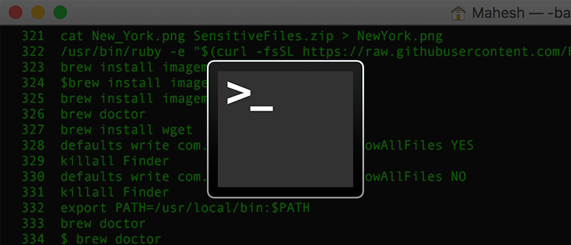
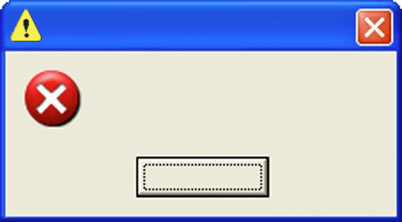

count:false
# Before we begin 

.font150[

<br><br>
- [GitHub desktop app](https://desktop.github.com/) installed?

- Create an account at [GitHub.com](http://www.github.com/)?

- If no to any, please do it now (recommend to exit zoom temporarily to allow for internet bandwidth)

]

---

background-image: url("Images/iceberg.jpg")
background-size: 50%
background-position: 100% 50%
# Motivation: Computational Reproducibility

<!--- https://imgflip.com/i/5lb28s -->

.pull-left[
<br>
.font120[
    Clarebout Principle:
    </br></br>
    “An article about computational science in a scientific publication is not the scholarship itself, it’s merely scholarship advertisement. The actual scholarship is the complete software development environment and the complete set of instructions which generated the figures.”
.right[  <cite> Buckheit and D.L. Donoho (1995, [2009](https://academiccommons.columbia.edu/doi/10.7916/D8QZ2MDS/download))</cite>]
]

]


---
# Git/Github for Version Control 
.font150[
<br>
- Version Control Software are an increasingly popular tool for computational reproducibility

- Git and Github are VCS to track the complete history of your files.   

- They are very popular among programmers, but not so much among non-programmers. 

- Why? I believe it has to do with GUIs.

]
---

# What is a GUI and why the bad reputation

.font150[
<br><br>
**G**raphical **U**ser **I**nterface   

- For most of us (non-programmers): *GUI = Software*.  

- GUIs are behind the popularization of personal computers. 

- Unfortunately GUIs are pretty bad at keeping a record of actions taken (bad for reproducibility).
]

---

# What is not a GUI?

.font140[  

- Any software that is run in the command line (aka terminal, shell, bash, etc).  

]



.font140[ 

- Git was designed to run in the command line.

- Today we will learn Git **without** the command line.
]

---

# What is Git 1/2
.font150[
<br>
- Git is a software designed to track the **entire** history of the code of a project. 

- Designed originally for software development, it has gained important traction in the research community. 

- Main appeal: facilitates full reproducibility and collaboration. 

- Git is mainly meant to work as a non-GUI (in the command line) software.   
**However:** most of the key features can be used through a GUI. 
]
---

# What is Git 2/2

.font150[ 
<br>
- By code git understands any type of plain text file (`myfile.R`, `myfile.do`, `.tex/.md/.txt/.csv/.etc`).

- This type of file can be understood as "human readable" as machine and human see the same fie. 

- Files that are "non-human readable" are called binary files (`myfile.docx`, `myfile.xlxs`, `.pdf/.exe/.dta/.etc`).

- Git can also detect changes in binary files, but it cannot show those changes.
]

---

# What is Github
.font150[
<br>
- Github is a company that provides two services (that we care of): 
  - A web hosting service for all our files track with git (public free/private $ or free if academic).  
  - A GUI software (Desktop App) that provides user friendly access to git.

- Others hosting ss include: Bitbucket, GitLab, Gitkraken, etc. 

- Other GUIs include: SourceTree, Gitkraken, Atom, RStudio.

]

---

# The Primary Goal of Version Control (for us)

.font150[
<br><br>
**The Goal:** keep track of any potentially meaningful modification to your code.  
]
--
.font150[
**Secondary Goal:** learn how to collaborate with others using Github.   
]
--
.font150[
**Bonus track:** get you excited about using open source statistical software (R, Python, Julia, etc)
]

---
# Strategy 1:  

.font150[
<br>
1. Agree on a naming convention with your co-authors (eg: YYYYMMDDfilename_INITALS).  

2. Begin working from the last saved version (eg: `20180325demo_FH.do`).  
3. At the end of the day, save on a new version (eg: `20180327demo_FH.do`).  

**Pros:** Easy adoption.   

**Cons:** Error prone, hard to document, lots of files for each document.     
]
---

# Strategy 2:  

.font150[
<br>

1. Name your file `filename` (ideally `01_filename`)  
2. Take a snapshot of your work every time you complete relevant change (day, hour or minutes).  
3. Update your entire working folder to the cloud.   


**Pros:** Error proof, seamless documentation, one file per document, track differences across all versions, meant to work with the cloud. 

**Cons:** Harder adoption.   
]
---
background-image: url("Images/phdcomics.png")
background-size: contain


# We want to avoid this situation:   


---
background-image: url("Images/version_control_diagram.svg")
background-size: contain 

# Comparison of Workflows


---

# Other reasons to use git

.font150[
<br><br>
- To access a whole new world of knowledge!    

- Great tool for collaboration.  
- Easier to test all sorts of ideas/models. 
]
---
background-image: url("Images/git.png")
background-size: contain
exclude:true
# Managing expectations
<!--
talk about undo here
-->
---
# Demos

## Five Demos: 
<br>
.font140[

1 - **Simple but instructive.**   

2 - Repeat with branches.  
 
3 - Repeat with collaboration: pull requests.   

4 - Repeat with collaboration: shared ownership.   

5 - Explore a real life repo.    
]
---

# Demo #1: We Start in the Cloud 
<br>
.font130[

1 -  Create [github.com](github.com) account and sign in.   

2 -  Let's look at some **repos:**  
  - Papers: [Labor](https://github.com/tyleransom/AES-Roy-Majors), [Health](https://github.com/mkiang/opioid_treatment_distance), [Public Finance](https://github.com/OpportunityInsights/welfare_analysis)    
  - Courses: [So](https://github.com/edrubin/EC607S21), [many](https://github.com/floswald/ScPo-Labor/), [methods](https://github.com/woerman/ResEcon703), [courses](https://github.com/paulgp/applied-methods-phd) 
  - Covid: [JHU](https://github.com/CSSEGISandData/COVID-19), [Imperial](https://github.com/ImperialCollegeLondon/covid19model), [NYT](https://github.com/nytimes/covid-19-data), [The Economist](https://github.com/TheEconomist/covid-19-excess-deaths-tracker), [EconTracker](https://github.com/OpportunityInsights/EconomicTracker)
  - and more: [nice diagrams](https://github.com/grantmcdermott/tikzexamples), [meta-guides](https://github.com/Alalalalaki/Guide2EconRA), [books](https://github.com/BITSS/ACRE), [guaguas!](https://github.com/rivaquiroga/guaguas)

3 -  First way to access content: download.   

4 -  What if you want to have your own copy of the repo? **Fork** it!  

]
---
# Demo #1: We move to our local computer 
<br>
.font130[
5 -  Now create your own repo. Initiate readme and make some edits.   

6 - **Clone** the repo. Explore the files and location.   

7 - Create new files, edit. And **commit**. Edit again, and commit again.   

8 - **Push.** Edit on github.com, and **pull.**   

9 - For this tutorial, best way to access previous version: explore in github.com and download.

]

<br><br><br><br>
.right[
[here is some help with the lingo](handout.pdf)
]

---
# Five Demos 2/5: 
<br>
.font140[

1 - Simple but instructive.   
    *Review: def repo, github.com, download, clone, destination folder, fork, create repo, commit, push, pull, delete, search repo, download old version.*   

2 - **Repeat with branches.**  
 
3 - Repeat with collaboration: pull requests.   

4 - Repeat with collaboration: shared ownership.   

5 - Explore a real life repo.     
    ]
---
# .font80[Demo #2: Branches and collaboration (we wil be here a while)]
<br>
.font140[

1 - Create a branch from previous repo.  

2 - Add new content (do not replace), commit a few times, and go back and forth to the main branch.  

3 - Go back to main branch (master), observe file, merge.  

4 - Look at the history of the main branch.   

5 - Repeat 1-3 but now replace instead of adding content.    
 
]
---
# Fatal Error!
<br><br><br><br>
```{r out.width = '50%', echo=FALSE, fig.align='center'}
# url
 
```


---
background-image: url("Images/calm_burn.jpg")
background-size: contain

# Burn it and start with a fresh copy!

<br><br><br><br><br><br><br><br><br><br><br><br><br><br><br><br>

.right[
  [Jenny Bryan's Advice](https://speakerdeck.com/jennybc/happy-git-and-github-for-the-user)
]
---
# Five Demos: 3/5 

<br>
.font140[


1 - Simple but instructive.   
    Review: def repo, github.com, download, clone, destination folder, fork, create repo, commit, push, pull, delete, search repo, download old version.  
    
2 - Repeat with branches.  
    *Review: All of the above, plus: branch, merge, resolve conflicts.*  
    
3 - **Repeat with collaboration: pull requests.**  

4 - Repeat with collaboration: shared ownership.     

5 - Explore a real life repo.  


]
---
# Two formats of collaboration  
<br>
.font140[

- One owner, many pull requests.  
    - Easier to control, requires constant updating of forks.   
    
- Many owners, all can push.   
    - **Very** important to pull at the beginning and at before each push. 
]
---
# Demo #3: Pull requests
<br>
.font140[

1 - Fork repo [github.com/BITSS/test_birthday](https://github.com/BITSS/test_birthday), and clone it into your machine.  

2 - Edit fields of name, and birth date.   

3 - Save, commit and push.   

4 - Create your first **pull request**.   

5 - Let's see if I can manage all those pull requests very quickly (maybe illustrate issues).   

6 - Now find your neighbors repo of Demos 1 & 2, fork it, clone it, make a change, save, commit, and...
] 

---
# Five Demos: 4/5 
.font140[
1 - Simple but instructive.   
    Review: def repo, github.com, download, clone, destination folder, fork, create repo, commit, push, pull, delete, search repo, download old version.  
    
2 - Repeat with branches.  
    Review: All of the above, plus: branch, merge, resolve conflicts.   
    
3 - Repeat with collaboration: pull requests.   
    *Review: collaborate via fork + PR*  
    
4 - **Repeat with collaboration: shared ownership. **    

5 - Explore a real life repo.  

]
---
# Demo #4: Many owners

.font140[
    
1 - Half of you (\#1): go back to the repo of demo 1 & 2 and invite a collaborator.  
(Suggestion: the "forker" finds the repo, the "forkee" is invited  
, edits, commits,  and push/pull)  
]
--
.font140[
2 - The other half (\#2): clones, commits and pushes.  
]
--
.font140[
3 - \#1 commits and pushes in **different lines**.    
]
--
.font140[
4 - Switch and repeat 2 & 3: \#2 commits first and pushes, then \#1.    
]
--
.font140[
5 - Repeat 2 - 4 but now both of you in the same lines.    
]

--
.font140[
6 - Repeat now but with branches (optional).    
]


---
# Five Demos: 5/5 
.font140[

1 - Simple but instructive.   
    Review: def repo, github.com, download, clone, destination folder, fork, create repo, commit, push, pull, delete, search repo, download old version.  

2 - Repeat with branches.  
    Review: All of the above, plus: branch, merge, resolve conflicts.   

3 - Repeat with collaboration: pull requests.   
    Review: collaborate via fork + PR  

4 - Repeat with collaboration: shared ownership.     
    *Review: collaborate via share ownership.*  

5 - **Explore a real life repo. ** 
]   


---
# Demo #5: .font80[Look inside a real-life project (and collaborate!)]
.font140[
1-  Find the following repo: [`github.com/BITSS/opa-wealthtax`](https://www.github.com/BITSS/opa-wealthtax).   

2-  Fork it and clone it.    

3-  Open it in your computer: `opa-wealthtax.Rproj` (needs RStudio), look around and execute 
`code/dynamic_doc/wealth_tax_dd.Rmd`.  

4-  Find elasticities at `rawdata/edits/research.csv``, modify one elasticity, document, execute again.

5 - Find `code/interactive_visualization/server.R` and in line `1561` change `red` to `blue`
]


---
# Five Demos: 5/5 
.font140[
1 - Simple but instructive.   
    Review: def repo, github.com, download, clone, destination folder, fork, create repo, commit, push, pull, delete, search repo, download old version.  
    
2 - Repeat with branches.  
    Review: All of the above, plus: branch, merge, resolve conflicts.   
    
3 - Repeat with collaboration: pull requests.   
    Review: collaborate via fork + PR  
    
4 - Repeat with collaboration: shared ownership.     
    Review: collaborate via share ownership.  
    
5 - Explore a real life repo.  
    *Review: All of the above, plus: how does a real-life example looks like.* 
]

---
# Now go and explore!
<br>
.font140[

Some good habits:   
- Commit often (<1hr)  

- Always pull before you start a new session of work. Also good to pull before pushing.    

- Think of your remote as the most important set of files. Get used to deleting things in your local machine.    
]

---
# Want to Learn More: Version Control

## Tutorials

.font140[

- [Great 20 min intro to Git by Alice Bartlett](https://www.youtube.com/watch?v=eWxxfttcMts)  
- [Great 2hr tutorial to Github by Jenny Bryan (git ninja)](https://www.rstudio.com/resources/videos/happy-git-and-gihub-for-the-user-tutorial/)  
- Software Carpentry's [step-by-step tutorial (command line)](https://swcarpentry.github.io/git-novice/). 
]

## Documentation

.font140[

- Jenny Bryan's [Happy Git](http://happygitwithr.com/)
- [Documentation from Matthew Gentzkow and Jesse Shapiro](http://web.stanford.edu/~gentzkow/research/CodeAndData.pdf)
- Karthik Ram's paper on [Git for Research](https://scfbm.biomedcentral.com/articles/10.1186/1751-0473-8-7) 
]

---
# .font80[Economists Doing Highly Reproducible Work<sup>1</sup>] 

.pull-left[

**People**
- [Nick Huntingon](https://github.com/NickCH-K) 
- [Shoshana Vasserman](https://github.com/shoshievass)  
- [Lars Vilhuber](https://github.com/larsvilhuber)
- [Grant McDermott](https://github.com/grantmcdermott)
- [Tyler Ransom](https://github.com/tyleransom)
- [Ed Rubin](https://github.com/edrubin)
- [Luiza Andrade](https://github.com/luizaandrade)
- [Max Kasy](https://github.com/maxkasy)
- [Matt Jensen](https://github.com/MattHJensen)
- [Jason DeBacker](https://github.com/jdebacker)
- [John Horton](https://github.com/johnjosephhorton)
- [Cora Kingdon](https://github.com/ckingdon95)
- [Chandler Lester](https://github.com/chandlerlester)

]
.pull-right[
- [Alvaro Carril](https://github.com/acarril)
- [Andrew Heiss](https://github.com/andrewheiss)
- [Lisa Rennels](https://github.com/lrennels)
- [Michael Stepner](https://github.com/michaelstepner)
- [Lachlan Deer](https://github.com/lachlandeer) 
- [Rebekah Din](https://github.com/rebekahanne)


**Organizations**
- [LOST](https://lost-stats.github.io/)
- [Opportunity Lab](https://github.com/Opportunitylab)
- [Congressional Budget Office](https://github.com/US-CBO)
- [Policy Simulation Library](https://github.com/PSLmodels)
- [Gentzkow & Shapiro Lab](https://github.com/gslab-econ)
- [Urban Institute](https://github.com/UrbanInstitute)
]

</br></br>
.footnote[
[1]: Non-exhaustive list of people and organizations doing amazing reproducible work on github (other than us!)
]


```{r gen_pdf, include = FALSE, cache = FALSE, eval = FALSE}
pagedown::chrome_print("01_slides.html", output = "01_slides.pdf")
```